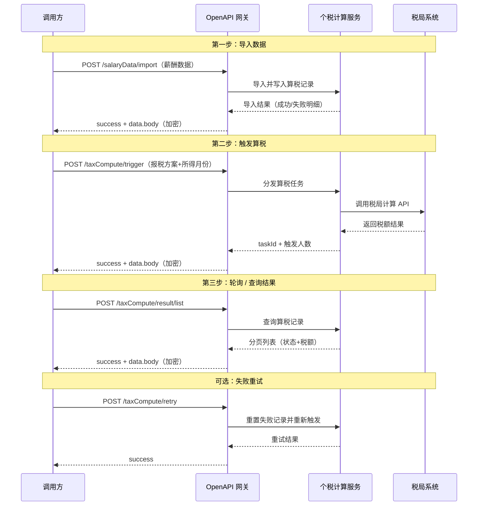
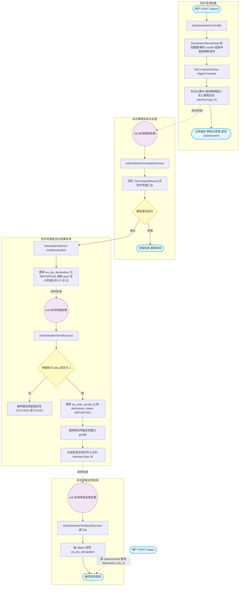

cha# 个税通SAAS系统对外API

---

## 目录

- [1、概述](#1概述)
- [2、环境说明](#2环境说明)
- [3、开通流程](#3开通流程)
- [4、接口安全说明](#4接口安全说明)
  - [请求体外层结构](#请求体外层结构)
  - [AES 加密规则](#aes-加密规则)
  - [签名规则（含服务端验签）](#签名规则)
  - [响应体结构](#响应体结构)
- [5、功能列表](#5功能列表)
  - [5.1 扣缴义务人模块](#51-扣缴义务人模块)
  - [5.2 人员报送模块](#52-人员报送模块)
  - [5.3 个税计算模块](#53-个税计算模块)
  - [5.4 个税申报模块](#54-个税申报模块)
- [6、附录](#6附录)

---

## 1、概述

个税通 SAAS 系统是为企业扣缴义务人提供的个人所得税一站式服务平台，帮助企业完成员工薪酬数据管理、个税计算、申报全流程自动化处理，与税局系统直连，降低企业税务合规成本。

**主要功能包括：**

- **薪酬数据管理**：支持批量导入员工薪酬数据，含多所得项目（工资薪金、劳务报酬、年金、股权激励等）
- **个税计算**：支持正常算税（SKJS）和隔月试算（GYSS）两种模式，自动完成税额计算并回填结果
- **个税申报**：基于算税结果向税局发起申报，支持正常申报与更正申报
- **附表管理**：支持减免事项、捐赠、商业健康险等附表数据填写与关联
- **多租户隔离**：通过 `cpId`（租户ID）+ `taxClassCode`（报税方案编码）精准隔离各企业数据

**接入方式：**

外部系统通过 OpenAPI 网关（`/api/v2/tax/...`）调用，所有接口均为 HTTP POST、JSON 格式，请求体统一加密后传输（详见第 2 节）。接入前请联系薪酬数科获取 `appId` 和 `appSecret`。


## 2、环境说明

| 环境 | 域名 | 说明 |
| :--- | :--- | :--- |
| 生产环境 | `www.yygongzi.com` | 正式业务使用，数据真实入库 |
| 测试环境 | `uat.yygongzi.com` | 联调测试使用，数据隔离，不影响生产 |

接口完整请求地址示例（以薪酬数据导入为例）：

```
# 测试环境
https://uat.yygongzi.com/api/v2/tax/salaryData/import

# 生产环境
https://www.yygongzi.com/api/v2/tax/salaryData/import
```

---

## 3、开通流程


**说明：**

1. **申请接入**：联系薪酬数科运营团队，说明接入的业务场景及预计接入规模
2. **创建账户**：薪酬数科为企业在系统中创建扣缴义务人账户，分配账号
3. **获取密钥**：获得测试环境 `appId` 和 `appSecret`，用于接口加密与签名
4. **完成联调**：在测试环境 (`uat.yygongzi.com`) 完成全流程接口联调验证
5. **切换生产**：联调通过后申请生产环境密钥，切换域名即可上线

---

## 4、接口安全说明

所有接口请求体均采用 **AES 加密 + MD5 签名** 机制，实际业务参数不直接暴露在请求体顶层。

### 请求体外层结构

```json
{
  "appId": "your_app_id",
  "sign": "md5签名字符串",
  "data": {
    "body": "AES加密后的业务参数（16进制字符串）"
  }
}
```

| 字段 | 说明 |
| :--- | :--- |
| appId | 平台分配的应用标识，由薪酬数科提供 |
| sign | 对 `data` 对象签名后的 MD5 值，生成规则见下方 |
| data.body | 业务参数 JSON 字符串经 AES 加密后的 16 进制密文 |

### AES 加密规则

- **算法**：`AES/ECB/PKCS5Padding`
- **密钥长度**：128 位，由 `appSecret` 通过 `SHA1PRNG` 派生
- **输出格式**：16 进制大写字符串
- **密钥来源**：`appSecret`（由薪酬数科提供，与 `appId` 配套）

```java
// 加密示例（Java）
String encryptedBody = TaxApiAesUtil.encrypt(bizBodyJsonStr, appSecret);
JSONObject bodyAes = new JSONObject();
bodyAes.put("body", encryptedBody);
```

### 签名规则

**调用方生成签名步骤：**

1. 取请求中的 `data` 对象（JSON 对象）
2. 将 `data` 对象按 `key=value,` 格式拼接字符串，末尾追加 `secret=<appSecret>`
3. 对拼接结果进行 URL Encode（UTF-8）
4. 对编码后字符串取 MD5（32 位小写）

```java
// 签名示例（Java）
String sign = TaxApiSignUtil.getSign(JSONObject.toJSONString(bodyAes), appSecret);
// 即：MD5( URLEncode( "body=<密文>,secret=<appSecret>" ) )
```

**服务端验签步骤：**

1. 根据请求中的 `appId` 查询对应的 `appSecret`
2. 取 `data` 对象所有字段，按**字典序（TreeMap）**排序后拼接字符串，末尾追加 `secret=<appSecret>`
3. 同样进行 URL Encode + MD5，得到 `sysSign`
4. 对比 `sysSign` 与请求中的 `sign` 是否相等，不相等则返回"签名校验失败"

> **注意**：服务端对 `data` 对象里的 key 会按**字典序排序（TreeMap）**后拼接验签。如果调用方的 `data` 对象只有 `body` 一个字段，则拼接结果固定为 `body=<密文>,secret=<appSecret>`，无顺序问题。

### 响应体结构

```json
{
  "success": true,
  "data": {
    "body": "AES加密后的业务响应（16进制字符串）"
  }
}
```

- `success=true` 时，`data.body` 为加密的业务响应，需用同一 `appSecret` 解密后得到实际 JSON
- `success=false` 时，直接读取错误信息，无需解密

---

## 5、功能列表

### 5.1 扣缴义务人模块

| 序号 | 接口名称 | 请求地址 | 说明 |
| :---: | :--- | :--- | :--- |
| 01 | [新增扣缴义务人](./扣缴义务人/01-新增扣缴义务人.md) | `/api/v2/tax/withholding-agent/save` | 创建扣缴义务人账户 |
| 02 | [更新扣缴义务人](./扣缴义务人/02-更新扣缴义务人.md) | `/api/v2/tax/withholding-agent/update` | 更新扣缴义务人信息 |
| 03 | [获取扣缴义务人详情](./扣缴义务人/03-获取扣缴义务人详情.md) | `/api/v2/tax/withholding-agent/get` | 根据 ID 查询详情 |
| 04 | [查询扣缴义务人列表](./扣缴义务人/04-查询扣缴义务人列表.md) | `/api/v2/tax/withholding-agent/list` | 分页查询扣缴义务人列表 |
| 05 | [搜索扣缴义务人](./扣缴义务人/05-搜索扣缴义务人.md) | `/api/v2/tax/withholding-agent/search` | 关键字搜索扣缴义务人 |
| 06 | [删除扣缴义务人](./扣缴义务人/06-删除扣缴义务人.md) | `/api/v2/tax/withholding-agent/delete` | 删除扣缴义务人 |
| 07 | [获取报税地区列表](./扣缴义务人/07-获取报税地区列表.md) | `/api/v2/tax/withholding-agent/taxArea/list` | 查询可用报税地区 |
| 08 | [预获取税局任务ID](./扣缴义务人/08-预获取税局任务ID.md) | `/api/v2/tax/withholding-agent/prepareTaskId` | 预获取税局系统任务ID |
| 09 | [根据任务ID查询税务机关](./扣缴义务人/09-根据任务ID查询税务机关.md) | `/api/v2/tax/withholding-agent/queryTaxAuthority` | 根据任务ID查询税务机关 |

### 5.2 人员报送模块

| 序号 | 接口名称 | 请求地址 | 说明 |
| :---: | :--- | :--- | :--- |
| 01 | [查询人员列表](./人员报送/01-查询人员列表.md) | `/api/v2/tax/person/list` | 分页查询人员列表 |
| 02 | [新增人员](./人员报送/02-新增人员.md) | `/api/v2/tax/person/save` | 新增报送人员 |
| 03 | [修改人员](./人员报送/03-修改人员.md) | `/api/v2/tax/person/update` | 修改人员信息 |
| 04 | [删除人员](./人员报送/04-删除人员.md) | `/api/v2/tax/person/delete` | 删除人员 |
| 05 | [批量删除人员](./人员报送/05-批量删除人员.md) | `/api/v2/tax/person/batchDelete` | 批量删除人员 |
| 06 | [单个报送人员](./人员报送/06-单个报送人员.md) | `/api/v2/tax/person/report` | 单个人员发起报送 |
| 07 | [批量报送人员](./人员报送/07-批量报送人员.md) | `/api/v2/tax/person

### 5.3 个税计算模块

#### 业务时序图



#### 接口列表

| 序号 | 接口名称 | 请求地址 | 说明 |
| :---: | :--- | :--- | :--- |
| 01 | [薪酬数据导入](./个税计算/01-薪酬数据导入.md) | `/api/v2/tax/salaryData/import` | 批量导入当月薪酬数据 |
| 02 | [薪酬数据查询](./个税计算/02-薪酬数据查询.md) | `/api/v2/tax/salaryData/list` | 分页查询导入的薪酬记录 |
| 03 | [生成 0 工资记录](./个税计算/03-生成0工资记录.md) | `/api/v2/tax/salaryData/zeroWage` | 为指定人员生成本期收入为 0 的记录 |
| 04 | [触发算税](./个税计算/04-触发算税.md) | `/api/v2/tax/taxCompute/trigger` | 批量或单人触发算税，支持 SKJS / GYSS 模式 |
| 05 | [重新触发算税](./个税计算/05-重新触发算税.md) | `/api/v2/tax/taxCompute/retry` | 对计算失败记录重新发起算税 |
| 06 | [算税结果查询](./个税计算/06-算税结果查询.md) | `/api/v2/tax/taxCompute/result/list` | 分页查询算税结果列表 |
| 07 | [算税汇总统计](./个税计算/07-算税汇总统计.md) | `/api/v2/tax/taxCompute/result/summary` | 查询总人数、总收入、应补退税总额 |
| 08 | [算税记录详情](./个税计算/08-算税记录详情.md) | `/api/v2/tax/taxCompute/result/detail` | 查询单条算税记录完整税额明细 |
| 09 | [导出算税结果](./个税计算/09-导出算税结果.md) | `/api/v2/tax/taxCompute/result/export` | 批量导出算税结果供回写 |

### 5.4 个税申报模块

#### 业务时序图

#### 接口列表

| 序号 | 接口名称 | 请求地址 | 说明 |
| :---: | :--- | :--- | :--- |
| 01 | [申报数据查询](./个税申报/个税申报-研发.md) | `/api/tax-declaration/external/query` | 分页查询指定月份、所得大类的申报汇总数据 |
| 02 | [个税申报提交](./个税申报/个税申报-研发.md) | `/api/tax-declaration/external/submit` | 提交个税申报任务，返回 `submissionId` 用于后续状态查询 |
| 03 | [申报详情查询](./个税申报/个税申报-研发.md) | `/api/tax-declaration/external/detail` | 查询申报状态及对应的算税明细分页数据 |
| 04 | [申报状态查询](./个税申报/个税申报-研发.md) | `/api/tax-declaration/external/status` | 根据 `submissionId` 查询当前申报处理状态 |

## 6、附录
