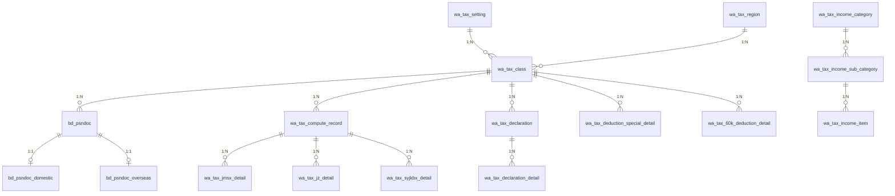

# 数据模型文档 - 个税通

## 文档信息

| 项目 | 内容 |
|------|------|
| 产品名称 | 个税通 |
| 数据库名 | salary_tax |
| 模型版本 | v1.0.0 |
| 创建日期 | 2026-03-31 |
| 文档状态 | 草稿 |

### 修订历史

| 版本 | 日期 | 修订人 | 修订内容 |
|------|------|--------|----------|
| v1.0.0 | 2026-03-31 | - | 初始版本创建 |

---

## 索引导航

| 序号 | 领域 | 文档 | 状态 | 说明 |
|------|------|------|------|------|
| 10 | 概述 | [10-模型概述.md](./10-概述/10-模型概述.md) | ✅ 已完成 | 命名规范、字段定义规范 |
| 20 | 人员域 | [20-人员数据表.md](./20-人员域/20-人员数据表.md) | ✅ 已完成 | 人员信息表、境内境外人员表 |
| 30 | 税务域 | [30-税务数据表.md](./30-税务域/30-税务数据表.md) | ✅ 已完成 | 报税方案、区域、字典、路由 |
| 40 | 算税域 | [40-算税数据表.md](./40-算税域/40-算税数据表.md) | ✅ 已完成 | 算税记录、减免、捐赠、健康险 |
| 45 | 扣除域 | [45-扣除数据表.md](./45-扣除域/45-扣除数据表.md) | ✅ 已完成 | 专项附加扣除、6万减除费用 |
| 50 | 申报域 | [50-申报数据表.md](./50-申报域/50-申报数据表.md) | ✅ 已完成 | 申报汇总、申报明细 |
| 60 | 公共域 | [60-公共数据表.md](./60-公共域/60-公共数据表.md) | ✅ 已完成 | 操作日志表 |

---

## 数据库概览

### 数据库信息

| 属性 | 说明 |
|------|------|
| 数据库名 | salary_tax |
| 字符集 | utf8mb4 |
| 排序规则 | utf8mb4_unicode_ci |
| 存储引擎 | InnoDB |

---

## 表关联关系

### ER图

### 关联表汇总

| 表名 | 中文名 | 关联表 | 关系 | 说明 |
|------|--------|--------|------|------|
| wa_tax_setting | 税号设置表 | wa_tax_class | 1:N | 一个税号设置对应多个报税方案 |
| wa_tax_region | 报税区域表 | wa_tax_class | 1:N | 一个区域对应多个报税方案 |
| wa_tax_class | 报税方案表 | bd_psndoc | 1:N | 一个方案含多个人员 |
| wa_tax_class | 报税方案表 | wa_tax_compute_record | 1:N | 一个方案多次算税 |
| wa_tax_class | 报税方案表 | wa_tax_declaration | 1:N | 一个方案多次申报 |
| wa_tax_class | 报税方案表 | wa_tax_deduction_special_detail | 1:N | 一个方案多个月扣除 |
| wa_tax_class | 报税方案表 | wa_tax_60k_deduction_detail | 1:N | 一个方案多年确认 |
| bd_psndoc | 人员信息表 | bd_psndoc_domestic | 1:1 | 境内人员扩展信息 |
| bd_psndoc | 人员信息表 | bd_psndoc_overseas | 1:1 | 境外人员扩展信息 |
| wa_tax_compute_record | 算税记录表 | wa_tax_jmsx_detail | 1:N | 一条算税多条减免 |
| wa_tax_compute_record | 算税记录表 | wa_tax_jz_detail | 1:N | 一条算税多条捐赠 |
| wa_tax_compute_record | 算税记录表 | wa_tax_syjkbx_detail | 1:N | 一条算税多条健康险 |
| wa_tax_declaration | 申报汇总表 | wa_tax_declaration_detail | 1:N | 一个申报多条明细 |
| wa_tax_income_category | 所得分类表 | wa_tax_income_sub_category | 1:N | 一个分类多个子分类 |
| wa_tax_income_sub_category | 所得子分类表 | wa_tax_income_item | 1:N | 一个子分类多个项目 |

---

## 通用字段规范

### 公共字段

所有业务表均包含以下公共字段：

| 字段 | 类型 | 约束 | 说明 |
|------|------|------|------|
| id / pk_xxx | BIGINT / VARCHAR | PK | 主键 |
| cp_id | VARCHAR(64) | NOT NULL | 租户ID |
| dr | TINYINT(1) | NOT NULL DEFAULT 0 | 删除标记：0-正常/1-已删除 |
| creator / create_by | VARCHAR(64) | NULL | 创建人 |
| create_time | DATETIME | NOT NULL | 创建时间 |
| modifier / update_by | VARCHAR(64) | NULL | 修改人 |
| modify_time / update_time | DATETIME | NOT NULL | 修改时间 |

---

## 相关文档

- [PRD需求文档](../prd/INDEX.md)
- [架构设计文档](../architecture-design/INDEX.md)
